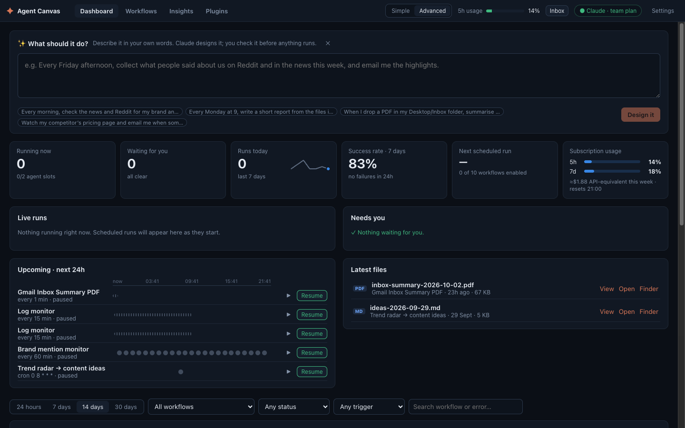
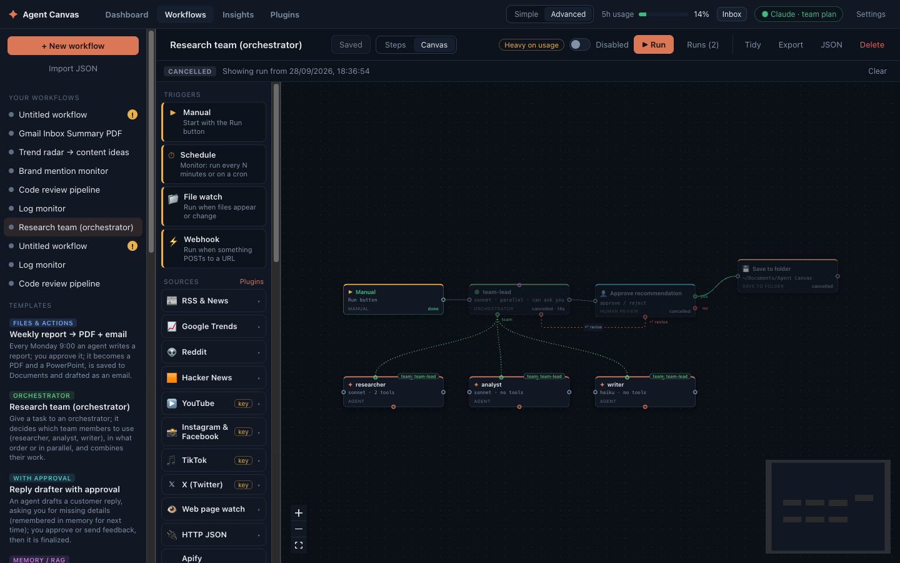
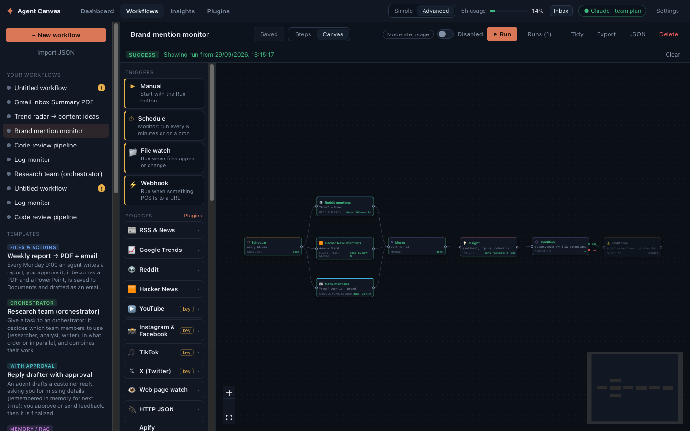
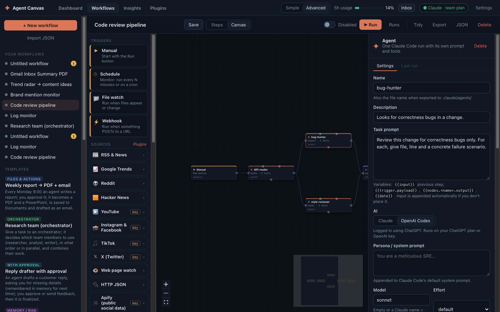
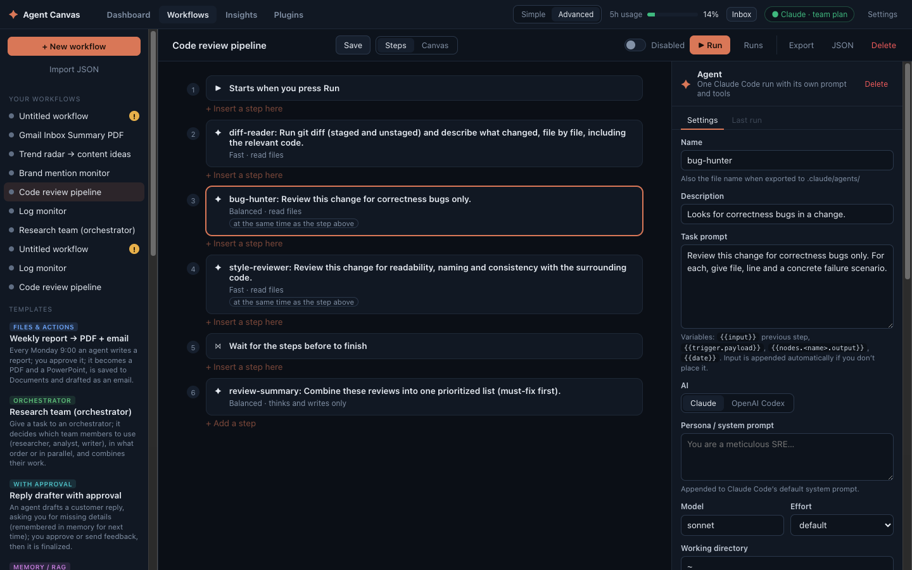
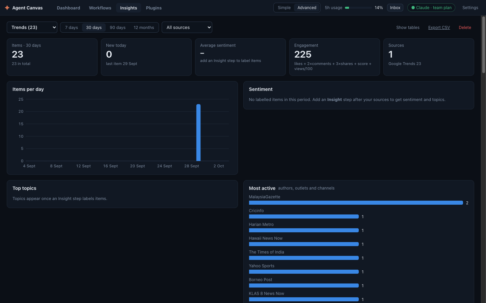
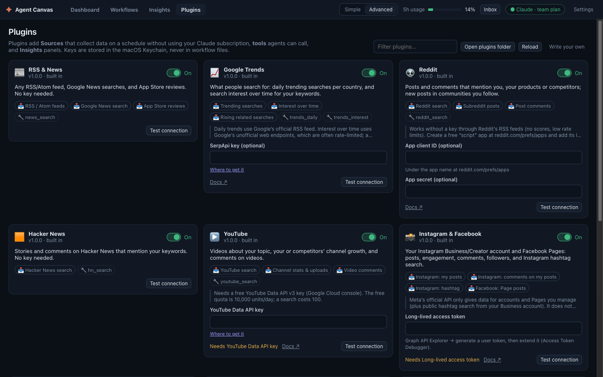
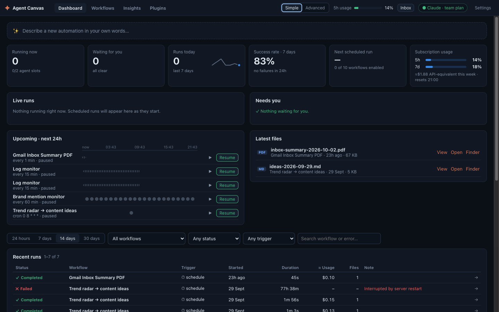

# Agent Canvas

Build Claude agents visually and run them on your **Claude subscription**: monitors on a schedule, agents triggered by files or webhooks, multi-step pipelines, and media trackers that collect posts, news, reviews and trends into datasets with insights.

Every agent step runs on the **Claude Agent SDK** or, per agent, **OpenAI Codex** (Codex SDK), using the account you logged into yourself: your Claude login (`claude auth login`) and, for Codex, `codex login` (ChatGPT plan or OpenAI key). The app never asks for, stores or sees credentials. Orchestrators and their team members always use Claude, since Codex has no subagents.

## Screenshots



| | |
|---|---|
|  |  |
| **Orchestrator and team.** A team lead delegates to researcher, analyst and writer agents, then waits for your approval. | **Sources and insights.** Reddit, Hacker News and news mentions are merged, labelled and checked; you're alerted on spikes. |
|  |  |
| **Pick the AI per agent.** Claude (Agent SDK) or OpenAI Codex, with the Codex sign-in status shown inline. | **Steps view.** The same workflow as a numbered list, for people who'd rather not use the canvas. |
|  |  |
| **Insights.** Items per day, sentiment, topics and the most active sources for a dataset. | **Plugins.** Sources and tools, with keys stored in the macOS Keychain and a connection test. |
|  | |
| **Simple mode.** Plain language and fewer settings; switch to Advanced in the top bar. | |

## For everyone: no terminal, no jargon

- **Mac app:** `npm run package:mac` builds `release/Agent Canvas.app` and a `.dmg`, with Node bundled inside. Drag it to Applications and double-click; it starts in the background and opens in your browser. It isn't signed yet, so the first time, right-click → **Open** → **Open**. Settings → **Start Agent Canvas when I log in** keeps schedules running after a restart; **Quit Agent Canvas** stops it. Logs go to `~/Library/Logs/Agent Canvas.log`. The app works on the same kind of Mac (Apple silicon or Intel) it was built on.
- **Setup screen** on first launch: it detects Claude Code, installs it with Anthropic's official installer if needed, and signs you in to your Claude plan in the browser (`claude auth login`). No terminal. It also asks for your email address (for "send it to me" steps).
- **Simple mode** (the default; switch in the top bar):
  - plain names: *AI step*, *If / Otherwise*, *Ask me to approve*…;
  - "What can it use?" checkboxes instead of tool names, and Fast / Balanced / Best instead of model names;
  - a folder picker, defaulting to a private folder the AI can't leave;
  - "Every weekday at 9:00" schedules instead of cron;
  - "If share of negative mentions is more than 30%" rules instead of code;
  - technical options hidden;
  - plain error messages with a fix button, a confirmation before a workflow starts sending things by itself, and a light / moderate / heavy usage hint.
- **Describe it:** type what you want ("Every morning, check the news and Reddit for my brand and email me a summary"). Claude designs the workflow; you see it as plain steps, answer a few questions (email, brand, folder), optionally ask for changes, and create it. Drafting takes about 20 seconds and a few cents of your plan's usage.
- **Template wizards:** in Simple mode, a template asks its few questions first ("Your brand name?", "Who gets the report?") and fills them in everywhere.
- **Steps view** (default in Simple mode): the workflow as a top-to-bottom list with If yes / Otherwise branches, "+ Insert a step here", and click-to-edit. The Canvas view shows the same thing as boxes and connections.

## Requirements

- A Claude plan (Pro, Max, Team or Enterprise) and Claude Code. The Setup screen installs Claude Code and signs you in if needed; or, in a terminal, run `claude` once and use `/login`. The badge in the top-right shows the login state.
- To build from source: Node 20+ (for the Mac app, the official nodejs.org or nvm build, not Homebrew's).

## Run

```bash
npm install        # also installs client/
npm run build
npm start          # http://127.0.0.1:3002
```

Dev mode: `npm run dev` (Nest on :3002 plus Vite on :5173 with hot reload).

Mac app: `npm run package:mac` builds `release/Agent Canvas.app` and `release/Agent-Canvas-<version>.dmg` to hand to people who don't use a terminal.

Environment variables: `PORT` (default 3002), `HOST` (default `127.0.0.1`), `AGENT_CANVAS_HOME` (data folder, default `~/.agent-canvas`), `CLAUDE_BIN`.

Other websites open in your browser can't drive the app: changes are only accepted from the app's own page, and only these hostnames are served (against DNS rebinding): `localhost`, IP addresses, `*.local`, the Public URL's host, and any listed in `AGENT_CANVAS_ALLOWED_HOSTS` (comma-separated). Webhooks and review links check their own tokens and work from any host.

## Dashboard

The app opens on the **Dashboard**; the canvas is under **Workflows**.

- **Needs attention** (only shown when something does): items waiting for you, failures in the last 24h (with the failing step's real error), skipped schedule ticks, triggers that failed to arm, CLI logged out, usage above 80%. Each item links to its cause.
- **Tiles:** running now, waiting for you, runs today (7-day sparkline), 7-day success rate vs the week before, next scheduled run, 5h/7d subscription usage with reset time. Click a tile to filter the history below.
- **Live runs:** each run's steps as progress dots, the current step, orchestrator team members, elapsed time, Stop.
- **Needs you:** approve, send back or answer right on the dashboard.
- **Upcoming:** a 24h timeline of schedule ticks, plus the file watches and webhooks currently listening. Pause/resume per workflow, Run now, **Pause all** (an emergency stop that also cancels running runs) and **Resume**.
- **Latest files:** open, show in Finder.
- **History** (one filter row: time range, workflow, status, trigger, search): recent runs table, workflow health (last 20 outcomes, success %, next run, on/off), and activity (runs per day, usage by workflow, top errors, and a table view of the chart).

Everything updates live. Charts follow the bundled dataviz guidance. Completed runs are blue and failed runs red because green/red failed the colour-blind separation check on this surface; status is always shown with an icon, not colour alone.

## Concepts

| Node | What it does |
|---|---|
| **Manual** | Starts from the **Run** button |
| **Schedule** | Every N minutes, or on a cron schedule. Use it for monitors. A tick is skipped if the previous run is still going |
| **File watch** | Starts when files are added, changed or deleted (path or glob, debounced) |
| **Webhook** | `POST /api/hooks/<workflow>/<node>` with a token; the JSON body becomes `{{trigger.payload}}` |
| **Agent** | One agent turn (Claude or Codex) with its own prompt, persona, model, tools, permission mode and working directory. It can be forced to return JSON (JSON Schema) |
| **Orchestrator** | An agent that coordinates a **team**. Drag from its green *team* handle to agents to make them team members. Given a task, it decides which members to use, briefs them, runs independent sub-tasks in parallel, checks their work and combines the results. Members run as Claude Code subagents inside the orchestrator's session (one process, one queue slot); each member's node lights up with its own activity and result |
| **Output file** | Turns the result into **PDF, PowerPoint, Word, Excel, HTML, Markdown, CSV, JSON or text**. *Quick convert* builds it locally from the Markdown in under a second, at no usage cost, with right-to-left support. *Designed by Claude* lets an agent build it with its own tools and skills (charts, themes); it's slower and uses your Claude usage. Files go to `~/.agent-canvas/outputs/<workflow>/` by default and flow on to later steps |
| **Actions** | *Save to folder*, *Send email* (macOS Mail app, as a draft or sent, or SMTP), *Slack / Teams / Webhook* (POST), *Notify me*, *Open file*. Actions receive the files from earlier Output nodes (e.g. email attachments) and pass the result on, so they can be chained |
| **Condition** | Branches **yes/no**, either with a JS rule (`output.severity === 'high'`) or by asking Claude a yes/no question |
| **Merge** | Joins parallel branches: wait for all of them, or continue on the first one |
| **Memory** | A context store, not a step. Connect it to agents (from its bottom handle to an agent's top handle). It holds **notes** (facts agents save, answers you gave) and **documents** indexed from files and folders (RAG). Agents get `memory_search` / `memory_save` tools, and notes can be put into their context up front. Scope it to one workflow, or share it across workflows by name |
| **Source** | Collects items from a **plugin**: Google News, RSS, App Store reviews, Google Trends, Reddit, Hacker News, YouTube, Instagram & Facebook, TikTok, X, any web page (change watch), any JSON API, Apify actors, or your own plugin. Items are de-duplicated into a named **dataset**; the step passes on a digest of what's new (`output.newCount`, `output.items`). Fetching uses no Claude usage. *Stop if nothing new* skips the rest of the run; *Keep going if this source fails* lets one flaky platform fail alone |
| **Insight** | Labels new dataset items with Claude (haiku by default, 25 per call): sentiment, topics, relevance to your brief, entities, language, a one-line summary, and custom fields. Its output (`count`, `avgSentiment`, `negativeShare`, `topTopics`, `mostNegative`…) can drive a Condition, e.g. alert when negative mentions spike |
| **Dataset** | A store, like Memory: connect it to an agent's top handle and the agent gets `dataset_stats`, `dataset_search` and `dataset_top` to analyse what the sources collected |
| **Human review** | Pauses the run for your **Approve / Reject** (with an optional comment). Approve → green "yes" output. To revise on reject, drag the orange **↩ revise** handle back to any earlier agent: it gets your feedback in its own session (and can ask you questions), every step between it and the review runs again, and you review the new result, up to N rounds. Otherwise reject takes the red "no" path. An optional time limit counts as a rejection |

Each step receives the previous step's output as `{{input}}`. If the prompt doesn't place `{{input}}` itself, the input is appended automatically. Other variables: `{{trigger.payload.*}}`, `{{nodes.<name>.output}}`, `{{date}}`.

Schedule, file and webhook triggers only fire while the workflow is **Enabled** and the app is running.

## Plugins, sources and insights

- **Plugins** (top bar → Plugins) add Sources, agent tools (e.g. `news_search`, `trends_interest`, `reddit_search`, `youtube_search`, `hn_search`) and Insights panels. Turn them on or off, add keys (stored in the macOS Keychain) and test the connection there. Each Source node has **Fetch sample** to preview what it returns before you run anything.
- No key needed: RSS & News (feeds, Google News search, App Store reviews), Google Trends (daily trending; interest over time uses Google's unofficial endpoint, or SerpApi with a key), Reddit (RSS; app credentials add scores and comments), Hacker News, Web page watch, HTTP JSON.
- With your own keys: YouTube (Data API key), X (paid API tier), Instagram & Facebook (Meta Graph token: **only accounts and Pages you manage**, plus Instagram hashtag search), TikTok (your own account only), Apify (public social data from third-party scrapers; you're responsible for each platform's terms).
- **Insights** (top bar) charts each dataset: items per day by source, sentiment, top topics and authors, followers/subscribers/search interest over time, the most engaging items, and a searchable feed, with a CSV export. It updates live while workflows run.
- Templates: *Brand mention monitor*, *Trend radar → content ideas*, *Weekly social media report*, *Competitor watch*, *App review digest*.
- Write your own plugin: a folder with `plugin.json` and `index.js` in `~/.agent-canvas/plugins/`. See [docs/plugins.md](docs/plugins.md) and the example in `examples/plugins/github-releases/`. Folder plugins start turned off, because they run code with your permissions.

## Human in the loop

- **Agents can ask you questions.** Turn on *Can ask me questions* on an agent. It gets an `ask_user` tool from the app's own tool server. When it calls the tool, a hook ends its turn right there (whatever it would have written next), the run pauses, and your answer resumes **the same Claude session** (`--resume`), so it keeps all its context.
- **Reviews** come from the Human review node (see above).
- Anything waiting shows in the **Inbox** (top bar), on the canvas (pulsing node plus a "Waiting for you" banner), in the tab title, and as a macOS notification (Settings).
- A waiting run holds no agent process and no queue slot. It can wait for hours, but **restarting the app cancels runs that are waiting**.
- Schedule ticks are skipped while that trigger's previous run is still waiting on you, so monitors don't pile up.
- **Notify the reviewer** (on Human review nodes, and "Notify when it asks" on agents that can ask): email (Mail app or SMTP), Slack, Teams, any webhook (JSON with the request and links), or a desktop notification, with optional reminders every N minutes up to M times. Each message has the content, a **Review now** link (a small page to approve, send back or answer, including from a phone if it can reach the app) and an **Open in Agent Canvas** link. Delivery results show in the step's activity. **Send test** checks your channels.
- Review links are single-use secrets per request. Opening a link only shows the form, so mail/chat link previews can't approve anything. Links point to this Mac unless you set **Settings → Public URL** (e.g. your Mac's LAN address with `HOST=0.0.0.0`, or a private tunnel).

## Orchestrator and team

- Team members are normal Agent nodes. Their **description** is how the orchestrator decides when to use them, so make it specific. Their prompt becomes standing instructions; the orchestrator's brief is the actual task.
- Members share the orchestrator's working directory. They can't ask you questions, but the orchestrator can (Can ask me questions). Members can use Memory and Dataset nodes connected to them. Each member gets its own tool server, so it sees only its own memories, datasets and plugin tools, and its notes are saved to its own memory.
- Background subagents are turned off for orchestrators (`CLAUDE_CODE_DISABLE_BACKGROUND_TASKS=1`), so every delegation reports back. Parallel work is several delegations in one turn.
- Tools allowed for any member are allowed for the whole session (permissions are per session in Claude Code), so a hook stops the orchestrator from using tools only its members have: it's told to delegate instead.
- Member nodes light up and record their results from Claude Code's SubagentStart/SubagentStop hooks.
- A Human review can loop back (↩ revise) to an orchestrator; it then re-plans with your feedback.

## Memory and RAG

- Search is local SQLite full-text search (FTS5 with BM25 ranking and stemming), so no embeddings API or API key is needed. It matches keywords and word forms, not meaning, so agents are told to search with several keywords.
- Indexing is incremental (by file modification time): text and code files up to 1 MB each, at most 3000 files per memory, skipping `node_modules`, `.git` and build folders. PDFs and Office files aren't indexed yet.
- **Remember my answers**: when a connected agent asks you something, the question and your answer are saved as a note, and the next run gets them up front instead of asking again.
- Several agents connected to one memory share it within a run and across runs. That's how later steps reuse what earlier ones found.
- Data lives in `~/.agent-canvas/memory.db`. A workflow's private memory is deleted with the workflow; shared memories are kept.
- Claude agents get these tools from an in-process MCP server (no extra process). Codex agents use the stdio server in `src/mcp/tools-server.ts`, which calls back over localhost with a per-process secret. Either way a tool only reaches the stores in that agent's own scope.

## Files and actions

- PDF uses the Chrome/Edge/Brave already installed (headless, with its own throwaway profile). The path can be set in Settings.
- Email through the **Mail app** uses the accounts set up there, with no password stored in this app. macOS asks once to allow controlling Mail. By default it opens a draft for you to check; "Send immediately" sends without asking.
- Email through **SMTP** is configured in Settings, and the password is kept in the macOS Keychain. SMTP always sends immediately, so put a Human review before it if you want to check first.
- Webhooks send the text and file *names/paths*. The files themselves stay on this Mac; use Email to send them.
- **Viewer:** click any produced file (in a step's *Last run*, the dashboard's *Latest files*, or a review card) to preview it in the app: PDF, Markdown, Word (.docx, and .doc/.rtf/.odt on macOS), Excel (every sheet), PowerPoint (slides with text and pictures), CSV/TSV, JSON, HTML, images, audio, video, code and any other text file. Use ← → to step through a run's files. Previews are rendered as sandboxed pages (no scripts run), because content can come from the web through agents.
- Files flow through Condition, Merge and Human review steps, so *Output → Review → Email* attaches the file you approved; the review card shows it.
- The UI can only download files that a run produced (looked up by id), never arbitrary paths.

## Safety defaults

- Agents run with `--permission-mode dontAsk` and `--permission-prompts none`, so only the tools you allow are available and headless runs never hang waiting on a permission prompt.
- Agents don't load your own Claude Code setup (CLAUDE.md files, skills, hooks, plugins, MCP servers), so a workflow behaves the same on every Mac. Turn on **Use my Claude Code settings** on an agent to load them. *Designed by Claude* output steps load your skills (for the document skills) but not your MCP servers.
- Every AI step has a **Max turns** and **Max spend** limit (Settings has the defaults: 100 turns, $10 as estimated by Claude Code). A step that reaches one stops and says which.
- Content from Sources, Insights, Datasets, plugin tools and webhooks is wrapped in `<untrusted_content>` tags, and the agent is told to treat it as data, never instructions. A step that reads such content while it can use Bash, Write, Edit, WebFetch or bypassPermissions gets a warning in its settings.
- Labelling and yes/no judging use a short system prompt of their own instead of Claude Code's (they have no tools), and leave no session files behind.
- **Usage limits:** when Claude reports when the limit resets and it's within **Settings → Wait for a usage-limit reset** (30 minutes by default), the step waits and retries. Otherwise it backs off and retries (twice by default), or fails and tells you the reset time.
- **Sandbox:** every Claude agent's shell commands run in the OS sandbox (Seatbelt on macOS, bubblewrap on Linux). They can write only inside the agent's working directory and have no network, unless you list sites under **Network for shell commands** on the step or in Settings. An orchestrator's sandbox covers its team. *Designed by Claude* output steps can write only into their output folder. Codex agents use Codex's own sandbox. You can turn the sandbox off per agent (with a warning), and it never falls back to running unsandboxed: if it can't start, the step fails and says why.
- **Protected files:** whether or not the sandbox is on, agents can't read or edit your keys and logins (`~/.ssh`, `~/.aws`, `~/.gnupg`, `~/.config/gh`, `~/.config/gcloud`, `~/.netrc`, `~/.npmrc`, `~/.docker`, `~/.kube`, the Keychains folder), Claude and Codex sessions and logins (`~/.claude/projects`, `~/.codex`), or the app's own data (memory, runs, datasets, settings, workflows, plugins). The workspace and outputs folders stay usable.
- WebSearch and WebFetch aren't shell commands, so the sandbox doesn't limit them. Limit WebFetch with rules like `WebFetch(domain:example.com)`.
- `bypassPermissions` is available per agent, with a warning. Use it only in throwaway folders.
- The server binds to localhost. Webhooks need a per-workflow token and only work while the workflow is enabled.
- **Settings → Max agents running at once** (default 2) queues extra runs, because they all share one subscription's usage limits. The top bar shows your 5-hour usage as reported by the CLI.

## Tests

```bash
npm test            # unit tests: no Claude usage
npm run test:live   # end-to-end with your Claude (and Codex, if signed in) login; uses a little usage (Haiku)
```

Tests use a throwaway data folder, never `~/.agent-canvas`.

## Data

- `~/.agent-canvas/workflows/*.json`: one JSON file per workflow (also downloadable or importable from the UI)
- `~/.agent-canvas/runs.db`: run history (SQLite), including each step's prompt, output, activity and session id
- `~/.agent-canvas/memory.db`: memory stores (notes and indexed document chunks)
- `~/.agent-canvas/datasets.db`: datasets (collected items, labels, time series) and each source's cursor
- `~/.agent-canvas/plugins/`: your own plugins
- `~/.agent-canvas/outputs/`: files made by Output nodes (default location)
- Each agent step is a normal Claude Code session. Continue it in your terminal with the `claude --resume <id>` command shown in the step's **Last run** tab.

## Export to Claude Code

**Export** writes each agent node as `.claude/agents/<name>.md` in a project folder, or in `~/` to make it available in every project. The agents then appear in `/agents` inside Claude Code.
